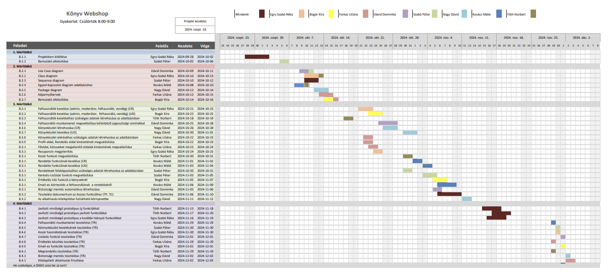

# Könyv Webshop Projektterv 2024

## 1. Összefoglaló 

A projekt célja egy olyan webalkalmazás fejlesztése, amely egy könyvesbolt működését támogatja mind a raktározási, mind az értékesítési folyamatok tekintetében. Az alkalmazás felhasználóbarát felületen keresztül biztosít lehetőséget a könyvkészlet nyilvántartására, valamint a rendelések kezelésére. Az online elérhetőség lehetővé teszi a felhasználók számára, hogy bárhonnan, bármikor hozzáférjenek az érdekelt könyvükkel kapcsolatos információkhoz. Ezen felül a vásárlók egy egyszerű keresőn keresztül böngészhetnek a kínálatunkban, és informálódhatnak a könyvek elérhetőségéről.

## 2. A projekt bemutatása

Ez a projektterv a Webshop projektet mutatja be, amely 2024-09-23-tól 2024-11-25-ig tart, azaz összesen 65 napon keresztül fog futni. A projekten nyolc fejlesztő fog dolgozni, az elvégzett feladatokat pedig négy alkalommal fogjuk prezentálni a megrendelőnek, annak érdekében, hogy biztosítsuk a projekt folyamatos előrehaladását.

### 2.1. Rendszerspecifikáció

A rendszerben lehetőség van felhasználók regisztrálására és bejelentkezésére. A vendég (nem bejelentkezett) felhasználók és a bejelentkezett felhasználók egyéni munkamenetben böngészhetek a könyvesbolt kínálatában. Lehetőség van keresésre a könyv címe, szerzője és a műfaja alapján. A bejelentkezett felhasználóknak emellett lehetősége van kosárba helyezni a kívánt könyvet, majd azt megrendelni, amelyről e-mailban értesítést kapnak. A rendszer az árukészletet automatikusan kezeli.

### 2.2. Funkcionális követelmények

- Könyv adatai: ISBN azonosító, cím, szerző, kiadó, ár, árukészlet

- Felhasználótól bekért adatok a regisztráció során: név, e-mail, jelszó

- Felhasználók kezelése (admin (eladó), felhasználó) (CRUD))
     - A felhasználó képes regisztrálni, bejelentkezni és kijelentkezni.
     - A moderátor képes létrehozni, olvasni, frissíteni és törölni könyveket. Emellett képes bejelentkezni és kijelentkezni.
     - Az admin képes létrehozni, olvasni, frissíteni és törölni könyvet valamint képes olvasni, frissíteni és törölni felhasználót. Emellett bejelentkezni és kijelentkezni is tud.

 - Felhasználói munkamenet megvalósítása több jogosultsági szinttel 
      - A webshopban regisztrált és vendég felhasználók vannak. 
      - Vendég jogosultság, amely során a vendég képes könyvek között böngészni.
      - Bejelentkezett felhasználó jogosultság, amely során a felhasználó képes könyvek között böngészni, könyvekhez véleményt írni, könyveket a kosarába rakni, a kosarát szerkeszteni, rendelést leadni és a régebbi rendeléseit megtekinteni.
      - Moderátor jogosultság, amely során a moderátor tud létrehozni, olvasni, frissíteni és törölni könyvet, emellett képes törölni a könyvekhez írt véleményeket is.
      - Admin jogosultság, amely során az admin tud létrehozni, olvasni, frissíteni és törölni felhasználót, véleményt és könyvet.

 - Keresési funkciók megvalósítása
      - A könyvek között tud keresni az összes felhasználó.

 - Árukészletek kezelése (CRUD)
     - A moderátor és az admin képes ellenőrizni, szerkeszteni és törölni az árukészletet.
     - A felhasználó látja, hogy az adott termékből hány darab van raktáron.
     - Rendelés esetén az árukészlet automatikusan frissül.

 - Rendelések kezelése (CRUD)
   - A felhasználó képes rendelést leadni, a kosárban lévő termékeket tudja megrendelni.
   - A moderátor és az admin tudja ellenőrizni és törölni a rendeléseket.

 - E-mail-es értesítés a rendelésekről
   - A felhasználó értesítést kap, ha megrendelte a könyveket.

### 2.3. Nem funkcionális követelmények

 - Reszponzív megjelenés
 - Az érzékeny adatokat biztonságosan tároljuk
 - A kliens oldal böngészőfüggetlen legyen
 - A legfrissebb technológiákat használja a rendszer

## 3. Költség- és erőforrás-szükségletek

Az erőforrásigényünk összesen 150 személynap, átlagosan 19-20 személynap/fő.

A rendelkezésünkre áll összesen 8 * 70 = 560 pont.

## 4. Szervezeti felépítés és felelősségmegosztás

A projekt megrendelője Dr. Pflanzner Tamás. A Webshop projektet a projektcsapat fogja végrehajtani, amely jelenleg nyolc fejlesztőből áll. A csapatban található tapasztalt és pályakezdő webprogramozó is, A tapasztalt projekttagok néhány éve, féléve dolgoznak az iparban, számos sikeres projektten vannak túl.
 - Kovács Máté (1 év fejlesztői tapasztalat a Kert-Elek kft.-nél)
 - Egry-Szabó Réka (0.5 éves szakmai tapasztalat az Evosoft kft.-nél)
 - Nagy Dávid (1 év egyetemi óraadói tapasztalat)
 - Farkas Liliána (1 év szakmai gyakorlati tapasztalat, a Zeto Eu kft.-nél)

### 4.1 Projektcsapat

A projekt a következő emberekből áll:

| Név             | Pozíció          |   E-mail cím (stud-os)        |
|-----------------|------------------|-------------------------------|
| Egry-Szabó Réka | Projektmenedzser | h257638@stud.u-szeged.hu      |
| Bogár Kíra      | Projekt tag      | h348223@stud.u-szeged.hu      |
| Dávid Dominika  | Projekt tag      | h257367@stud.u-szeged.hu      |
| Farkas Liliána  | Projekt tag      | h258208@stud.u-szeged.hu      |
| Nagy Dávid      | Projekt tag      | h267914@stud.u-szeged.hu      |
| Tóth Norbert    | Projekt tag      | h270245@stud.u-szeged.hu      |
| Szabó Péter     | Projekt tag      | h164215@stud.u-szeged.hu      |
| Kovács Máté     | Projekt tag      | h266624@stud.u-szeged.hu      |


## 5. A munka feltételei

### 5.1. Munkakörnyezet

A projekt a következő munkaállomásokat fogja használni a munka során:
 - Munkaállomások: 8 db, Windows 10/11-es operációs rendszerrel.
 - Lenovo IdeaPad Gaming 3 (CPU: AMD Ryzen 7 5800H 16GB Ram RTX 3050 VGA)
 - MSI GF63 Thin 10SCSR  (CPU: Intel(R) Core(TM) i7-10750H CPU @ 2.60GHz Memory: 16 GB @ 1200 MHz)
 - ASUS VivoBook laptop (CPU: 11th Gen Intel(R) Core(TM) i5-1135G7 @ 2.40GHz, RAM: 16 GB, GPU: Intel(R) Iris(R) Xe Graphics)
 - Lenovo IdeaPad Gaming 3 (Processzor 11th Gen Intel(R) Core(TM) i5-11320H @ 3.20GHz 3.19 GHz Memória mérete 16,0 GB)
 - Lenovo Legion 5 (CPU: AMD Ryzen 7 5800H, RAM: 16 GB, GPU: NVIDIA GeForce RTX 3060 Mobile)
 - Asztali számítógép: Processzor 11th Gen Intel(R) Core(TM) i5-11400H @ 2.70GHz 2.69 GHz Memória mérete 8,00 GB NVIDIA GEFORCE RTX 3050Ti
 - Lenovo ThinkPad L460 (CPU: Intel(R) Core(TM) i3-6100U CPU @ 2.30GHz CPU: Intel(R) HD Graphics 520)
 - Acer Aspire E5-571, Intel(R) Core(TM) i7-4510U CPU, RAM: 12,0 GB, Nvidia geforce 840M

A projekt a következő technológiákat/szoftvereket fogja használni a munka során: 

 - Heroku platformszolgáltatás a webalkalmazás hosztolásához
 - XAMPP által biztosított MariaDB adatbázisszerver
 - NodeJS keretrendszer
 - Visual Studio Code IDE fejlesztőkörnyezet
 - Git verziókövető (GitLab)

### 5.2. Rizikómenedzsment

| Kockázat                                    | Leírás                                                                                                                                                                                     | Valószínűség | Hatás  |
|---------------------------------------------|--------------------------------------------------------------------------------------------------------------------------------------------------------------------------------------------|--------------|--------|
| Betegség                                  | Minden esetben hátráltató a munkavégző számára, súlyosab esetben akár teljesen ki is eshet egy időre. Megoldás: feladatok átcsoportosítása        | nagy       | kicsi-erős |
| Határidők be nem tartása | Egyes csapattagok késéssel végzik el feladataikat, ami az egész projektet késlelteti. Megoldás: Szigorú határidők betartatása | nagy       | erős |
| Források hiánya | Jelen helyzetben ez leginkább az időre vonatkozik, ha nem gazdálkodunk vele jól, akkor abból végzetes hiba is lehet. Megoldás: Időterv készítése, betartása. | közepes     | erős |
| Kommunikációs problémák | A hiányos vagy nem megfelelő kommunikáció félreértésekhez vezethet. Megoldás: Rendszeres meetingek, ezen megbeszélések vázlatos írásba foglalása, tiszta, mindenki számára értelmezhető kommunikációs csatornák használata.| közepes        | erős |
| Technikai hibák | Szoftveres és hardveres problémák, amik akadályozhatják a munkát. Megoldás: Backup eszköz használata, felhőalapú mentés | alacsony | erős |
| Feladatok rossz elosztása | Valaki ezáltal túlterheltté, ebből kifolyólag pedig feszültebbé válhat, ezzel konfliktust kiváltva a csapatban. Aki kevesebb munkát kap, az pedig kevésbé érzi hasznosnak magát, demotiválttá válhat a sikerélmények hiány miatt. Megoldás: Kiegyensúlyozott feladatelosztás, esetleg rendszeres felülvizsgálat. | közepes | közepes |
| Tudásbeli különbségek | Előfordulhat, hogy bizonyos csapattagok nem feltétlen olyan erősek a projekt alatt használt nyelvekben, eszközök használatában, mint társaik. Megoldás: Tapasztaltabb tagok mentorálják a többieket, osszák meg a tudásukat. | közepes | közepes |
| Motiváció hiánya | A motiváció hiánya jelentősen lelassíthatja a projekt haladását. Megoldás: Csapatszellem erősítése, rendszeres visszajelzések | közepes | közepes |
| Túlzott tervezés | Ez a megvalósítás rovására is mehet, valamint a túltárgyalás is vezethet félreértésekhez. Megoldás: Agilis módszertan alkalmazása, meghatározott időkeretek a tervezési fázisokhoz. | közepes | alacsony |
| Egyéb nem kiszámítható tényező | Előfordulhat, hogy olyan nem várt események következnek be mint például internet vagy áramszünet. E dolgok hátráltathatják az aktuális csapattagot a munkája elvégzésében. Megoldás: Igyekezzünk mindig olyankor végezni a munkát amikor a fejlesztéshez szükséges eszközök rendelkezésre állnak. | kicsi | erős |

## 6. Jelentések

### 6.1. Munka menedzsment
A munkát Egry-Szabó Réka koordinálja. Fő feladata, hogy egyeztessen a csapattagokkal az előrehaladásról, a felmerülő problémákat számon tartsa és legjobb tudása szerint segítse a  megoldásukat. Továbbá felel a csoportgyűlések fő témájának megtervezéséért, illetve hatékony lebonyolításáért.


### 6.2. Csoportgyűlések

A projekt hetente kétszer ülésezik, hogy megvitassák a felmerülő problémákat, illetve hogy megbeszéljék a következő feladatokat. A megbeszélésről minden esetben memó készül.

1. megbeszélés:
 - Időpont: 2024.09.23.
 - Hely: Discord csoport
 - Résztvevők: Mindenki
 - Érintett témák: Projekttéma kiválasztása, bemutatót ki készíti (Peti), a heti feladatok megbeszélése: minta projektet megnézni és feltölteni, diagrammok és egyéni jelentéseket létrehozni, következő meeting megbeszélése: péntek este 8

2. megbeszélés:
 - Időpont: 2024.09.27.
 - Hely: Discord csoport
 - Résztvevők: Bogár Kíra, Dávid Dominika, Farkas Liliána, Kovács Máté, Nagy Dávid, Szabó Péter, Tóth Norbert
 - Érintett témák: Ötletelés a tervezett funkciókról, adatbázis: mit tároljunk és hogyan, projektterv kitöltélésenek felosztása

3. Megbeszélés:
 - Időpont: 2024.10.01.
 - Hely: Discord csoprot
 - Résztvevők: Dávid Dominika, Egry-Szabó Réka, Farkas Liliána, Kovács Máté, Szabó Péter
 - Érintett témák: Csapat adatok felvétele, feladatok kiosztása, Gantt-diagram kitöltése

4. Megbeszélés
 - Időpont: 2024.10.06.
 - Hely: Discord csoport
 - Résztvevők: Bogár Kíra, Dávid Dominika, Egry-Szabó Réka, Farkas Liliána, Kovács Máté, Szabó Péter, Tóth Norbert
 - Érintett témák: Projekttervvel kapcsolatos kérdések egyeztetése (használt technológiák, prezentáció), feladatok kibővítése/új feladatok felosztása, erőforrásigények/pontozás megbeszélése

5. Megbeszélés
 - Időpont: 2024.10.08.
 - Hely: Discord csoport
 - Résztvevők: Bogár Kíra, Egry-Szabó Réka, Farkas Liliána, Kovács Máté, Szabó Péter, Tóth Norbert
 - Érintett témák: 1.mérföldkő utolsó teendőinek megbeszélése

6. Megbeszélés
- Időpont: 2024.10.13.
- Hely: Discord csoport
- Résztvevők: Bogár Kíra, Dávid Dominika, Egry-Szabó Réka, Farkas Liliána, Kovács Máté, Nagy Dávid, Szabó Péter, Tóth Norbert
- Érintett témák: Projektterv javítása visszajelzés alapján

7. Megbeszélés
- Időpont: 2024.10.20.
- Hely: Discord csoport
- Résztvevők: Bogár Kíra, Dávid Dominika, Egry-Szabó Réka, Farkas Liliána, Kovács Máté, Nagy Dávid, Tóth Norbert
- Érintett témák: Heti haladás, egyeztetés a következő teendőkről. Sequence diagram témák kiosztása

8. Megbeszélés
- Időpont: 2024.10.23.
- Hely: Discord csoport
- Résztvevők: Bogár Kíra, Dávid Dominika, Egry-Szabó Réka, Farkas Liliána, Kovács Máté, Nagy Dávid, Szabó Péter, Tóth Norbert
- Érintett témák: 2.mérföldkő eredményeinek megbeszélése, kijavítása, véglegesítése

9. Megbeszélés
- Időpont: 2024.10.27.
- Hely: Discord csoport
- Résztvevők: Bogár Kíra, Dávid Dominika, Egry-Szabó Réka, Kovács Máté, Nagy Dávid, Szabó Péter, Tóth Norbert
- Érintett témák: Projekt alap futtatása

10. Megbeszélés
- Időpont: 2024.11.03.
- Hely: Discord csoport
- Résztvevők: Bogár Kíra, Dávid Dominika, Egry-Szabó Réka, Farkas Liliána, Kovács Máté, Nagy Dávid, Szabó Péter, Tóth Norbert
- Érintett témák: Prioritást élvező funkciók/függőségek megbeszélése, határidő: 10.-re az oldal funkciói nagyvonalakban működjenek

11. Megbeszélés
- Időpont: 2024.11.10.
- Hely: Discord csoport
- Résztvevők: Bogár Kíra, Dávid Dominika, Egry-Szabó Réka, Farkas Liliána, Kovács Máté, Nagy Dávid, Szabó Péter, Tóth Norbert
- Érintett témák: Haladásról egyeztetés, mi van kész/mi maradt el

12. Megbeszélés
- Időpont: 2024.11.13.
- Hely: Discord csoport
- Résztvevők: Bogár Kíra, Dávid Dominika, Egry-Szabó Réka,Kovács Máté, Szabó Péter, Tóth Norbert
- Érintett témák: 3.mérföldkő eredményeinek megbeszélése, feladatok összeírása a 4.mérföldkőre

13. Megbeszélés
- Időpont: 2024.11.19.
- Hely: Discord csoport
- Résztvevők: Bogár Kíra, Dávid Dominika, Egry-Szabó Réka, Farkas Liliána, Kovács Máté, Nagy Dávid, Szabó Péter, Tóth Norbert
- Érintett témák: 4.mérföldkő új feladatainak kiosztása/kérdések tisztázása, alkalmazás kitelepítésével kapcsolatos kérdések átbeszélése

14. Megbeszélés
- Időpont: 2024.12.01.
- Hely: Discord csoport
- Résztvevők: Dávid Dominika, Egry-Szabó Réka, Farkas Liliána, Kovács Máté, Szabó Péter, Tóth Norbert
- Érintett témák: Átbeszéltük ki hol tart és megnéztük milyenek lettek a javítások, szerda estére mindennek kész kell lennie.

### 6.3. Minőségbiztosítás

Az elkészült terveket a terveken nem dolgozó csapattársak közül átnézik, hogy megfelel-e a specifikációnak és az egyes diagramtípusok összhangban vannak-e egymással. A meglévő rendszerünk helyes működését a prototípusok bemutatása előtt a tesztelési dokumentumban leírtak végrehajtása alapján ellenőrizzük és összevetjük a specifikációval, hogy az elvárt eredményt kapjuk-e. További tesztelési lehetőségek: unit tesztek írása az egyes modulokhoz vagy a kód közös átnézése (code review) egy, a vizsgált modul programozásában nem résztvevő csapattaggal. Szoftverünk minőségét a végső leadás előtt javítani kell a rendszerünkre lefuttatott kódelemzés során kapott metrikaértékek és szabálysértések figyelembevételével.
Az alábbi lehetőségek vannak a szoftver megfelelő minőségének biztosítására:
- Specifikáció és tervek átnézése (kötelező)
- Teszttervek végrehajtása (kötelező)
- Unit tesztek írása (választható)
- Kód átnézése (választható)

### 6.4. Átadás, eredmények elfogadása

A projekt eredményeit a megrendelő, Dr. Pflanzner Tamás fogja elfogadni. A projektterven változásokat csak a megrendelő írásos engedélyével lehet tenni. A projekt eredményesnek bizonyul, ha specifikáció helyes és határidőn belül készül el. Az esetleges késések pontlevonást eredményeznek. 
Az elfogadás feltételeire és beadás formájára vonatkozó részletes leírás a következő honlapon olvasható: https://okt.inf.szte.hu/rf1/

### 6.5. Státuszjelentés

Minden mérföldkő leadásnál a projekten dolgozók jelentést tesznek a mérföldkőben végzett munkájukról a a megadott sablon alapján. A gyakorlatvezetővel folytatott csapatmegbeszéléseken a csapat áttekintik és felmérik az eredményeket és teendőket. Továbbá gazdálkodnak az erőforrásokkal és szükség esetén a megrendelővel egyeztetnek a projektterv módosításáról.

## 7. A munka tartalma

### 7.1. Tervezett szoftverfolyamat modell és architektúra

A fejlesztés során az agilis fejlesztési modellt alkalmazzuk, mivel nagy hangsúlyt helyezünk a csapattagok közötti kommunikációra, valamint a rugalmasságra. A szoftver specifikációinak változását ezzel a modellel tudjuk a leggyorsabban lereagálni.

A webalkalmazás az MVC (modell-nézet-vezérlő) architektúrát használja, ahol a szerver és a kliens részben egymástól függetlenül működnek. A webalkalmazás HTTP kérésekkel és API végpontokon keresztül fog kommunikálni.

### 7.2. Átadandók és határidők

A főbb átadandók és határidők a projekt időtartama alatt a következők:


| Szállítandó |                 Neve                                                        |   Határideje  |
|:-----------:|:---------------------------------------------------------------------------:|:-------------:|
|      D1     |      Projektterv és Gantt chart, prezentáció, egyéni jelentés               | 2024-10-07  |
|    P1+D2    |      UML, adatbázis- és képernyőtervek, prezentáció, egyéni jelentés        | 2024-10-21  |
|    P1+D3    |      Prototípus I. és tesztelési dokumentáció, egyéni jelentés              | 2024-11-11  |
|    P2+D4    |      Prototípus II. és frissített tesztelési dokumentáció, egyéni jelentés  | 2024-12-02  |

```
D - dokumentáció, P - prototípus
```


## 8. Feladatlista

A következőkben a tervezett feladatok részletes összefoglalása található.

### 8.1. Projektterv (1. mérföldkő)

Ennek a feladatnak az a célja, hogy megvalósításhoz szükséges lépéseket, az erőforrásigényeket, az ütemezést, a felelősöket és a feladatok sorrendjét meghatározzuk, majd vizualizáljuk Gantt diagram segítségével.

Részfeladatai a következők:

#### 8.1.1. Projektterv kitöltése

Felelős: Egry-Szabó Réka

Feladat elkészítője: Egry-Szabó Réka, Bogár Kíra, Farkas Liliána, Dávid Dominika, Kovács Máté, Nagy Dávid, Tóth Norbert 

Tartam:  4 nap

Erőforrásigény:  1 személynap/fő


#### 8.1.2. Bemutató elkészítése

Felelős: Szabó Péter

Feladat elkészítője: Szabó Péter

Tartam:  2 nap

Erőforrásigény:  1 személynap


A mérföldkőhöz tartozó feladatok bemutatása PPT keretében, pl. téma, tervezett funkciók, tagok, Gantt diagram.


### 8.2. UML és adatbázis- és képernyőtervek (2. mérföldkő)

Ennek a feladatnak az a célja, hogy a rendszerarchitektúrát, az adatbázist és webalkalmazás kinézetét megtervezzük.

Részfeladatai a következők:

#### 8.2.1. Use Case diagram

Felelős: Dávid Dominika

Feladat elkészítője: Dávid Dominika, Szabó Péter

Tartam:  3 nap

Erőforrásigény:  1,5 személynap

#### 8.2.2. Class diagram

Felelős: Egry-Szabó Réka

Feladat elkészítője: Egry-Szabó Réka, Tóth Norbert

Tartam:  4 nap

Erőforrásigény:  1,5 személynap

#### 8.2.3. Sequence diagram

Felelős: Szabó Péter

Feladat elkészítője: Egry-Szabó Réka, Bogár Kíra, Farkas Liliána, Dávid Dominika, Kovács Máté, Nagy Dávid, Tóth Norbert 

Tartam:  3 nap

Erőforrásigény:  1 személynap/fő

#### 8.2.4. Egyed-kapcsolat diagram adatbázishoz

Felelős: Kovács Máté

Feladat elkészítője: Kovács Máté, Tóth Norbert

Tartam:  3 nap

Erőforrásigény:  1 személynap

#### 8.2.5. Package diagram

Felelős: Nagy Dávid

Feladat elkészítője: Nagy Dávid

Tartam:  3 nap

Erőforrásigény:  1 személynap

#### 8.2.6. Képernyőtervek

Felelős: Farkas Liliána

Feladat elkészítője: Farkas Liliána

Tartam:  3 nap

Erőforrásigény:  1 személynap

#### 8.2.7. Bemutató elkészítése

Felelős: Bogár Kíra

Feladat elkészítője: Bogár Kíra, Farkas Liliána

Tartam:  1 nap

Erőforrásigény:  0.5 személynap/fő


A mérföldkőhöz tartozó feladatok bemutatása PPT keretében (elkészült diagramok és képernyőtervek)


### 8.3. Prototípus I. (3. mérföldkő)

Ennek a feladatnak az a célja, hogy egy működő prototípust hozzunk létre, ahol a vállalt funkcionális követelmények nagy része már prezentálható állapotban van. 

Részfeladatai a következők:

#### 8.3.1. Felhasználók kezelése (admin, moderátor, felhasználó, vendég) (CR)

Felelős: Egry-Szabó Réka

Feladat elkészítője: Egry-Szabó Réka

Tartam:  3 nap

Erőforrásigény:  2 személynap

#### 8.3.2. Felhasználók kezelése (admin, moderátor,  felhasználó, vendég) (UD)

Felelős: Bogár Kíra

Feladat elkészítője: Bogár Kíra

Tartam:  3 nap

Erőforrásigény:  2 személynap

#### 8.3.3. Felhasználók kezeléséhez szükséges adatok létrehozása az adatbázisban

Felelős: Tóth Norbert

Feladat elkészítője: Tóth Norbert

Tartam:  2 nap

Erőforrásigény:  1 személynap

#### 8.3.4. Felhasználói munkamenet megvalósítása különböző jogosultsági szinttekkel

Felelős: Dávid Dominika

Feladat elkészítője: Dávid Dominika

Tartam:  4 nap

Erőforrásigény:  2 személynap

#### 8.3.5. Könyvkészlet létrehozása (CR)

Felelős: Nagy Dávid

Feladat elkészítője: Nagy Dávid

Tartam:  6 nap

Erőforrásigény:  1,5 személynap

#### 8.3.6. Könyvkészlet kezelés (UD)

Felelős: Nagy Dávid

Feladat elkészítője: Nagy Dávid

Tartam:  6 nap

Erőforrásigény:  1,5 személynap

#### 8.3.8. Könyvkészlet eléréséhez szükséges adatok létrehozása az adatbázisban

Felelős: Farkas Liliána

Feladat elkészítője: Farkas Liliána

Tartam:  2 nap

Erőforrásigény:  0,5 személynap

#### 8.3.9. Profil oldal, Rendelés oldal kinézetének megvalósítása

Felelős: Bogár Kíra

Feladat elkészítője: Farkas Liliána

Tartam:  2 nap

Erőforrásigény:  0,5 személynap

#### 8.3.10.  Főoldal, könyveket megjelenítő oldalak kinézetének megvalósítása

Felelős: Farkas Liliána

Feladat elkészítője: Farkas Liliána

Tartam:  2 nap

Erőforrásigény:  0,5 személynap

#### 8.3.11. Reszponzív megjelenítés

Felelős: Egry-Szabó Réka

Feladat elkészítője: Egry-Szabó Réka

Tartam:  2 nap

Erőforrásigény:  0,5 személynap

#### 8.3.12. Kosár funkció megvalósítása

Felelős: Tóth Norbert

Feladat elkészítője: Tóth Norbert

Tartam:  2 nap

Erőforrásigény:  1,5 személynap

#### 8.3.13. Rendelés funkciónak kezelése (CR) 

Felelős: Kovács Máté

Feladat elkészítője: Kovács Máté

Tartam:  2 nap

Erőforrásigény:  2 személynap

#### 8.3.14. Rendelés funkciónak kezelése (UD)

Felelős: Kovács Máté

Feladat elkészítője: Kovács Máté

Tartam:  2 nap

Erőforrásigény:  1,5 személynap

#### 8.3.15. Rendelések feldolgozásához szükséges adatok létrehozása az adatbázisban

Felelős: Szabó Péter

feladata elkészítője: Szabó Péter

Tartam:  2 nap

Erőforrásigény:  1 személynap

#### 8.3.16. Keresés-Listázás funkció megvalósítása

Felelős: Szabó Péter

Feladat elkészítője: Szabó Péter

Tartam:  3 nap

Erőforrásigény:  1 személynap

#### 8.3.17. Értékelés írás funkció a könyveknél

Felelős: Bogár Kíra

Feladat elkészítője: Bogár Kíra

Tartam:  3 nap

Erőforrásigény:  1 személynap


#### 8.3.18. Email-es kiértesítés a felhasználónak  a rendeléséről 

Felelős: Kovács Máté

Feladat elkészítője: Kovács Máté

Tartam:  4 nap

Erőforrásigény:  0,5 személynap

#### 8.3.19. Biztonsági mentés automatikus létrehozása 

Felelős: Dávid Dominika

Feladat elkészítője: Dávid Dominika

Tartam:  1 nap

Erőforrásigény:  1,5 személynap

#### 8.3.20. Tesztelési dokumentum az összes funkcióhoz (TP, TC) 

Felelős: Dávid Dominika

Feladat elkészítője: Egry-Szabó Réka, Bogár Kíra, Farkas Liliána, Dávid Dominika, Kovács Máté, Nagy Dávid, Tóth Norbert 

Tartam:  5 nap

Erőforrásigény:  1 személynap/fő

#### 8.3.21. Az alkalmazás kitelepítése futtatható környezetbe 

Felelős: Nagy Dávid

Feladat elkészítője: Nagy Dávid

Tartam:  2 nap

Erőforrásigény:  1 személynap

### 8.4. Prototípus II. (4. mérföldkő)

Ennek a feladatnak az a célja, hogy az előző mérföldkő hiányzó funkcióit pótoljuk, illetve a hibásan működő funkciókat és az esetlegesen felmerülő új funkciókat megvalósítsuk. Továbbá az alkalmazás alapos tesztelése is a mérföldkőben történik az előző mérföldkőben összeállított tesztesetek alapján.

Részfeladatai a következők:

#### 8.4.1. Javított minőségű prototípus új funkciókkal

Felelős: Tóth Norbert

Feladat elkészítője: Egry-Szabó Réka, Bogár Kíra, Farkas Liliána, Dávid Dominika, Kovács Máté, Nagy Dávid, Tóth Norbert 

Tartam:  4 nap

Erőforrásigény:  2 személynap/fő

#### 8.4.2. Javított minőségű prototípus javított funkciókkal

Felelős: Tóth Norbert

Feladat elkészítője: Egry-Szabó Réka, Bogár Kíra, Farkas Liliána, Dávid Dominika, Kovács Máté, Nagy Dávid, Tóth Norbert 

Tartam:  4 nap

Erőforrásigény:  1 személynap/fő

#### 8.4.3. Javított minőségű prototípus a korábbi hiányzó funkciókkal

Felelős: Egry-Szabó Réka

Feladat elkészítője: Egry-Szabó Réka, Bogár Kíra, Farkas Liliána, Dávid Dominika, Kovács Máté, Nagy Dávid, Tóth Norbert 

Tartam:  4 nap

Erőforrásigény:  1.5 személynap/fő

#### 8.4.4. Felhasználói munkamenet tesztelése (TR)

Felelős: Kovács Máté

Feladat elkészítője: Kovács Máté

Tartam:  1 nap

Erőforrásigény:  0,5 személynap

#### 8.4.5. Könnyvkészlet kezelésének tesztelése (TR)

Felelős: Szabó Péter

Feladat elkészítője: Szabó Péter

Tartam:  1 nap

Erőforrásigény:  0.5 személynap

#### 8.4.6. Kosár használatának tesztelése (TR)

Felelős: Egry-Szabó Réka

Feladat elkészítője: Egry-Szabó Réka

Tartam:  1 nap

Erőforrásigény:  0,5 személynap

#### 8.4.7. Listázás funkció tesztelése (TR)

Felelős: Dávid Dominika

Feladat elkészítője: Dávid Dominika

Tartam:  1 nap

Erőforrásigény:  0.5 személynap

#### 8.4.8. Értékelés készítés tesztelése (TR)

Felelős: Farkas Liliána

Feladat elkészítője: Farkas Liliána

Tartam:  1 nap

Erőforrásigény:  0.5 személynap

#### 8.4.9. Email-es funkciók tesztelése (TR)

Felelős: Bogár Kíra

Feladat elkészítője: Bogár Kíra

Tartam:  1 nap

Erőforrásigény:  0.5 személynap

#### 8.4.10. Megrendelés tesztelése (TR)

Felelős: Tóth Norbert

Feladat elkészítője: Tóth Norbert

Tartam:  1 nap

Erőforrásigény:  0.5 személynap

#### 8.4.11. Biztonsági mentés tesztelése (TR)

Felelős: Nagy Dávid

Feladat elkészítője: Nagy Dávid

Tartam:  1 nap

Erőforrásigény:  0.5 személynap

#### 8.4.12. A prototípus kitelepítésének frissítése

Felelős: Farkas Liliána

Feladat elkészítője: Farkas Liliána

Tartam:  1 nap

Erőforrásigény:  0.5 személynap


Működő végleges program, a frissített tesztelési dokumentációval. A 3. mérföldkőhöz képest funkiconálisan többet kell tudnia az oldalnak.


## 9. Részletes időbeosztás



## 10. Projekt költségvetés


Az egyes leadások alkalmával rögzített erőforrásigényt, az elvállalt feladatok számát 
és az adott mérföldkőben végzett munkáért szerezhető pontszámot kell beírni minden emberre külön-külön.
Figyeljünk arra, hogy mivel mindenkinek minden mérföldkövön dolgoznia kell, ezért a 10.3-as táblázat
minden módosítható oszlopában legalább 1 pontnak szerepelni kell.


### 10.1. Részletes erőforrásigény (személynap)


| Név          |   M1  |   M2  |   M3 |   M4  | Összesen |
|--------------|-------|-------|------|-------|----------|
| Egry-Szabó Réka | 1   | 2      | 3.5 | 5   | 11.5     |
| Bogár Kíra      | 1   | 1.5    | 4   | 5  | 11.5     |
| Dávid Dominika  | 1   | 2     | 4.5 | 5   | 12.5     |
| Farkas Liliána  | 1   | 2.5   | 2.5 | 5.5 | 11.5     |
| Nagy Dávid      | 1   | 2     | 4   | 5   | 12     |
| Tóth Norbert    | 1   | 2.5   | 3.5 | 5   | 12     |
| Szabó Péter     | 2   | 1.5   | 3   | 5   | 11.5     |
| Kovács Máté     | 1   | 1.5   | 5   | 5   | 12.5     |


### 10.2. Részletes feladatszámok

| Név          |   M1  |   M2  |   M3 |   M4 | Összesen |
|--------------|-------|-------|------|------|----------|
| Egry-Szabó Réka | 1  | 2   | 3  | 4  | 10     |
| Bogár Kíra      | 1  | 2   | 3  | 4  | 10     |
| Dávid Dominika  | 1  | 2   | 3  | 4  | 10     |
| Farkas Liliána  | 1  | 3   | 4  | 5  | 13     |
| Nagy Dávid      | 1  | 2   | 3  | 4  | 10     |
| Tóth Norbert    | 1  | 3   | 4  | 4  | 12     |
| Szabó Péter     | 2  | 2   | 3  | 4  | 11     |
| Kovács Máté     | 1  | 2   | 4  | 4  | 11     |

### 10.3. Részletes költségvetés

| Név                                 | M1      | M2       | M3       | M4       | Összesen  |
|-------------------------------------|---------|----------|----------|----------|-----------|
| Maximálisan megszerezhető pontszám  |  (7)    | (20)     | (35)     |  (28)    | 100% (70) |
| Egry-Szabó Réka                     | 4    | 12     | 30     |  24    | 70        |
| Bogár Kíra                          | 4    | 12     | 30     |  24    | 70        |
| Dávid Dominika                      | 4    | 12     | 30     |  24    | 70        |
| Farkas Liliána                      | 4    | 12     | 30     |  24    | 70        |
| Nagy Dávid                          | 4    | 12     | 30     |  24    | 70        |
| Tóth Norbert                        | 4    | 12     | 30     |  24    | 70        |
| Szabó Péter                         | 4    | 12     | 30     |  24    | 70        |
| Kovács Máté                         | 4    | 12     | 30     |  24    | 70        |

Szeged, 2024-10-09.
